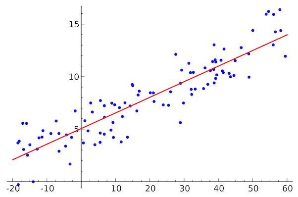

# Minimos Cuadrados

## Funciones predictoras lineales

### Implementación Matemática

Los mínimos cuadrados es un método utilizado en estadística y matemáticas para encontrar la mejor aproximación lineal a un conjunto de datos. Su objetivo es encontrar una línea (o un plano, o un hiperplano en dimensiones superiores) que minimice la suma de los cuadrados de las diferencias verticales (distancia) entre los puntos de datos y la línea de ajuste.

Para definir un problema, supongamos que tienes un conjunto de datos compuesto por pares ordenados $ (x_i,y_i) $, donde $ x_i $ es la variable independiente (predictora) e $ y_i $​ es la variable dependiente (respuesta).

En este caso, buscamos el caso más simple, una línea recta que mejor se ajuste a los datos. En nuestro caso, la línea se representa como $ y=mx+b $, donde $ m $ es la pendiente de la línea y $ b $ es la intersección con el eje $ y $.

Entonces, como lo que buscamos es una recta, nuestras incognitas serán, el valor de la pendiente $ m $ y el valor de la ordenada al origen $ b $.



Para cada punto de coordenadas $ (x_i,y_i) $, calculamos la **_diferencia_** entre el valor observado $ y_i $​ y el valor predicho por la línea de ajuste $ mx_i+b $. Esto nos permite definir la **_función error_** que se puede calcular sumando el error residual $ (e_i​) $ de cada punto, que no es más que dicha diferencia "$ (mx_i + b) - (y_i) $". Entonces:

$$
E(m,b) = \sum_{i=1}^{n} (d_i)^2 = \sum_{i=1}^{n} [(mx_i + b) - y_i]^2
$$

El objetivo es minimizar la suma de los cuadrados de estos errores residuales. Matemáticamente es:

$$
Minimizar \sum_{i=1}^{n} (mx_i + b - y_i)^2
$$

Entonces para encontrar los valores óptimos de $ m $ y $ b $ que minimizan la suma de los cuadrados de los residuos, se utilizan técnicas de cálculo diferencial. Los valores óptimos de $ m $ y $ b $ se obtienen igualando las derivadas parciales de la función de error con respecto a $ m $ y $ b $ a cero, y luego resolviendo las ecuaciones resultantes.

Entonces, buscamos la derivada parcial respecto de $ m $:

$$
\frac{\partial E}{\partial m} = \frac{\partial (\sum_{i=1}^{n} [(mx_i + b) - y_i]^2)}{\partial m}
$$

Como la derivada de una suma es la suma de las derivadas, entonces podemos sacar la sumatoria y proceder a derivar respecto de $ m $, resultando:

$$
\frac{\partial E}{\partial m} = \sum_{i=1}^{n} 2 \cdot (mx_i + b - y_i) \cdot x_i
$$

Ahora, hacemos lo mismo con la variable $ b $:

$$
\frac{\partial E}{\partial m} = \frac{\partial (\sum_{i=1}^{n} [(mx_i + b) - y_i]^2)}{\partial m} = \sum_{i=1}^{n} 2 \cdot (mx_i+b - y_i) 
$$

Entonces, como tenemos las derivadas parciales respecto de $ m $ y respecto de $ b $, vamos a igualarlas a $ 0 $ y armamos un sistema de ecuaciones lineales para buscar nuestras variables:

$$
\left\{
\begin{align*}
\sum_{i=1}^{n}& 2 \cdot (mx_i+b-y_i) \cdot x_i = 0 \\
\sum_{i=1}^{n}& 2 \cdot (mx_i+b-y_i) \hspace{17pt} = 0
\end{align*}
\right.
$$

Operando un poco en las ecuaciones de los sistemas obtenemos:

$$
\left\{
\begin{align*}
\sum_{i=1}^{n}& (mx_i^2+bx_i-y_ix_i) = 0 \\
\sum_{i=1}^{n}& (mx_i+b-y_i) \hspace{19pt} = 0
\end{align*}
\right.
$$

Para simplificar nuestra notación, vamos a asumir que nuestra sumatoria es desde $ i=1 $ hasta $ n $. Luego vamos a operar en nuestro sistema de ecuaciónes para facilitar su resolución:

1. Distribuir la sumatoria entre los terminos:
$$
\left\{
\begin{align*}
\sum & mx_i^2+ \sum bx_i - \sum y_ix_i = 0 \\
\sum & mx_i+ \sum b - \sum y_i \hspace{19pt} = 0
\end{align*}
\right.
$$
2. Extraer los productos constantes de los terminos de la sumatorias (no los de nuestra función):
$$
\left\{
\begin{align*}
m \cdot \sum & x_i^2+ b \cdot \sum x_i - \sum y_ix_i = 0 \\
m \cdot \sum & x_i+ b - \sum y_i \hspace{42pt} = 0
\end{align*}
\right.
$$
3. Sumar en ambos miembros aquellos términos que contengan la imagen de la función:
$$
\left\{
\begin{align*}
m \cdot \sum & x_i^2+ b \cdot \sum x_i = \sum y_ix_i \\
m \cdot \sum & x_i+ b \hspace{34pt} = \sum y_i
\end{align*}
\right.
$$

La solución de este sistema, serán los valores de $m$ y $b$ que nos dan la recta que mejor aproxima el conjunto de valores que teníamos. 
Recordemos que $ \sum x_i, \sum y_i $ y todas estas expresiones que tenemos en las ecuaciones de nuestro sistema, serán números que resultan de sumar los valores de todos los puntos de muestra que teniamos al comienzo del problema.

### Implementación Algoritmica

Dados todos los valores de los puntos de muestra $(x_i,y_i)$, para una estimación con una función lineal, el sistéma de ecuaciones a resolver será aquel planteado en la implementación matemática. Entoces los datos necesarios para armar el sistema son:

1. $ \sum_{n=1}^{n} x_i $
2. $ \sum_{n=1}^{n} x_i^2 $
3. $ \sum_{n=1}^{n} y_i $
4. $ \sum_{n=1}^{n} x_i \cdot y_i $

Cuya implementación en pseudocódigo será:

```python
# datos es nuestro array de valores (x_i,y_i)
sum_1, sum_2, sum_3, sum_4 = 0
for x_i, y_i in datos:
    sum_1 += x_i
    sum_2 += x_i**2
    sum_3 += y_i
    sum_4 += x_i * y_i
```

Teniendo estos datos, debemos resolver el SEL correspondiente para obtener los valores de $ m $ y $ b $. En este apartado debemos prestar atención respecto del método a elegir para resolver el sistema. Podriamos utilizar métodos numéricos como el de Jacobi o el método de Gauss-Seidel para obtener soluciones aproximadas de los SEL de forma rápida, o bien implementar algoritmicamente el método de eliminación de Gauss o el método de Cramer para obtener la solución exacta del sistema pero con un complejidad temporal elevada. 

#### Análisis de Complejidad Temporal

Si hacemos un analisis temporal: intentar implementar algoritmos cuya solución es aproximada pero rapida, contra un algoritmo cuya solución es exacta pero lenta ¿De cuanta diferencia de tiempo estamos hablando? 

##### Gauss-Seidel

Veamos, la implementación de un algoritmo como el de Gauss-Seidel requiere realizar un número lineal de operaciones que dependen del tamaño del sistema de ecuaciones y de la precisión que se busca obtener en el resultado. Si llamamos $k$ a la cantidad de iteraciónes que debemos realizar para obtener la presición deseada y $n$ al número de ecuaciones del sistema, el costo temporal será principalmente determinado por el número de operaciones realizadas en cada iteración $(n)$ multiplicado por el número máximo de iteraciones hasta llegar a la precisión deseada $(k)$. Por ende estaríamos hablando de una complejidad temporal de $O(k \cdot n)$ que puede expresarse como un algoritmo de complejidad temporal de orden lineal. Este análisis de complejidad temporal está basado en la notación [Big O](https://es.wikipedia.org/wiki/Cota_superior_asint%C3%B3tica)

##### Eliminación de Gauss

Ahora, por otro lado, si buscamos obtener la solución exacta del sistema, buscamos la implementación algorítmica del método de eliminación de Gauss (o también podría ser la regla de Cramer). En el método de eliminación de Gauss, donde $n$ es el número de ecuaciones tendremos:

1. **Eliminación hacia adelante**: En la eliminación hacia adelante, se realizan operaciones elementales en cada fila para eliminar las incógnitas por debajo de la _diagonal principal_. Esto requiere $O(n^2)$ operaciones, ya que hay $n$ filas y, en cada fila, se realizan aproximadamente $n$ operaciones.

2. **Sustitución hacia atrás**: En la sustitución hacia atrás, se realizan operaciones elementales en cada fila para resolver las incógnitas de abajo hacia arriba. Esto también requiere `\(O(n^2)\)` operaciones.

Por lo tanto, la complejidad total del algoritmo es dominada por la etapa de eliminación hacia adelante, lo que resulta en una complejidad total de aproximadamente `$O(n3)$`. Esto significa que el tiempo de ejecución del algoritmo aumenta considerablemente con el tamaño del sistema (el número de ecuaciones).